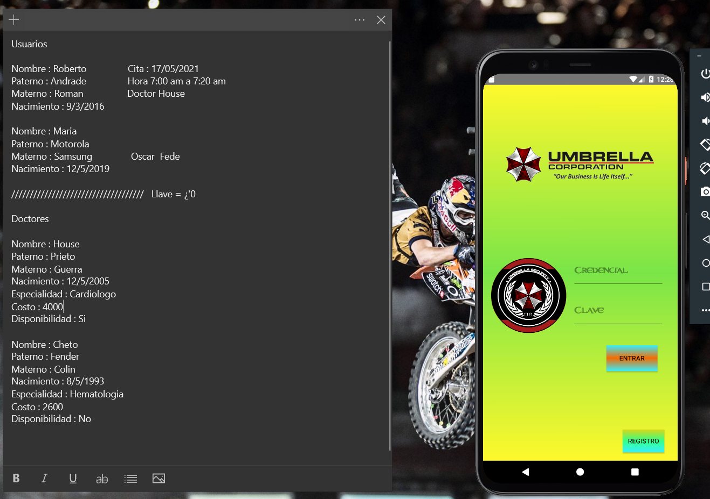
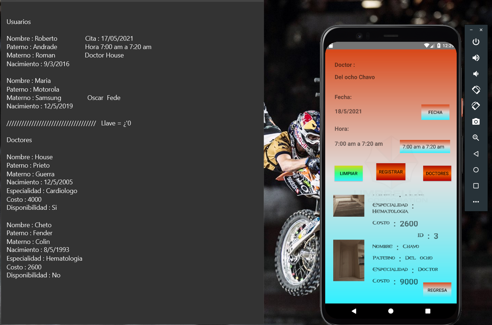
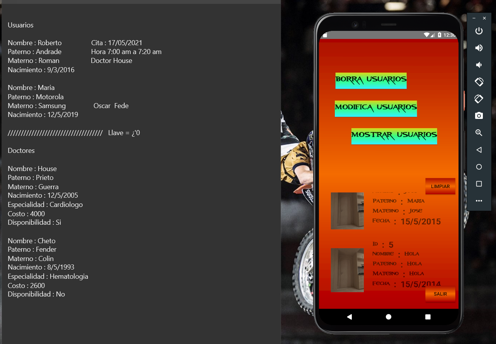

# Citas y Gestion de un Hospital Android en Kotlin
## Gestion de citas en un Hospital

Lenguaje: Kotlin
Base de datos: Mysqli
Android Version: 6.1

En el presente proyecto, se realizo una Aplicacion Movil en lenguaje Kotlin orientado a la gestion de citas, registro y consulta de usuarios y doctores de un hospital.  

## Gestion de citas, de acuerdo a horarios y fechas. Siempre y cuando el doctor este disponible

## Lectura, modificacion y eliminacion de usuarios y doctores.

